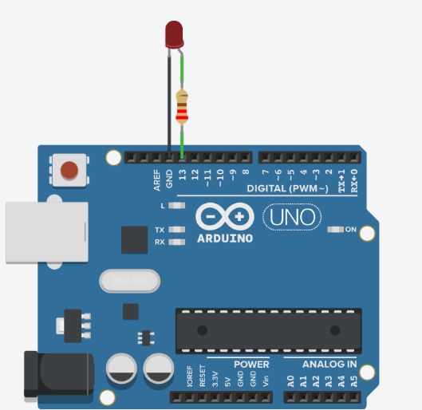
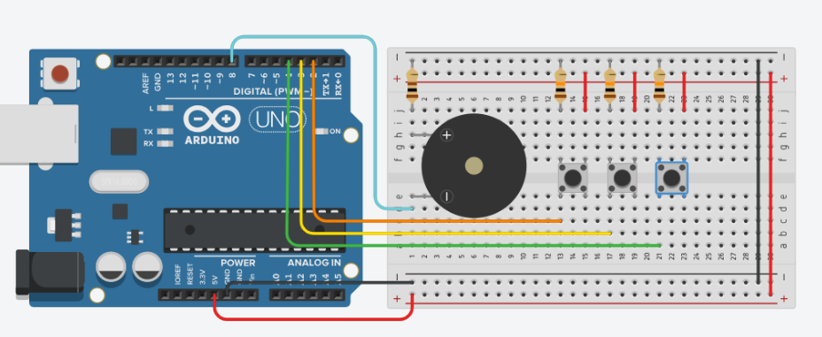
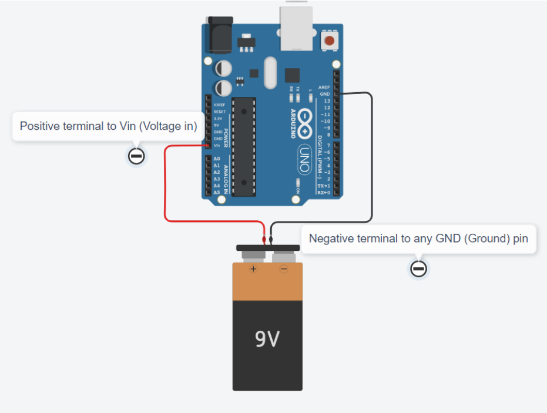
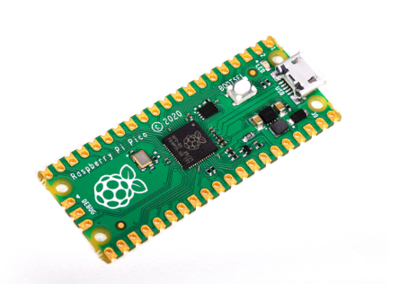

# Arduino Table of Contents {#arduino-table-of-contents}

[**Arduino Table of Contents	1**](#arduino-table-of-contents)

[**Getting Started**](#getting-started)

[**Basic Hardware**](#basic-hardware)

[**Basic Software**](#basic-software)

[**Advanced Tips**](#advanced-tips)

# 

# ---

# 

# Getting Started {#getting-started}

Introduction:

Arduino is a microcontroller platform that makes it easy to control circuits with code. It serves as an excellent introduction to basic circuit design, C syntax programming, and working with signals.

Applications:

1. **Electronics Design:** Using an Arduino requires basic knowledge of design a circuit with components. Taking an electromagnetism course is helpful for scientific understanding, but is not necessary. The Arduino fundamentally serves as a controllable power source in any circuit design.  
2. **Electrical Prototyping:** Arduino, when used in conjunction with a breadboard, can be used to prototype circuit functionality before hardwiring components.  
3. **Electronics Controlling:** Arduino allows users to control electrical signals in their circuits using software. For example, one may use a time delay function to obtain discrete outputs rather than continuous ones, such as Arduino making a light blink instead of just turning it on and off. Likewise, a circuit may incorporate sending an input signal to the Arduino, such as a button press telling the Arduino to send power to an LED.

(REQUIRED) Getting Started:

1. Set up your Arduino environment. (Choose one of the following steps:)  
   1. See TinkerCad Training Module if using Arduino virtually. (Warning: Computing power is substantially limited compared to physical Arduino.)  
   2. Download the Arduino IDE from the [Microsoft Store](https://www.microsoft.com/store/productId/9NBLGGH4RSD8?ocid=pdpshare) app (Windows 10 and 11\)  
   3. Download the Arduino IDE from the [Arduino website](https://www.arduino.cc/en/software) (Other Windows, Linux, maxOS)  
      1. If you are using an older operating system, scroll down and download the “Legacy IDE”  
   4. IDE Stands for Integrated Development Environment. It’s a place where you can write your code and upload it to your Arduino.  
2. Connect your Arduino to your environment.  
   1. See TinkerCad Training Module if using Arduino virtually.  
   2. Use the USB cable in your Arduino kit (USB B to A cable) to connect your Arduino to your computer.  
   3. In your Arduino IDE, navigate to your task bar at the top of the window. Select Tools \> Port \> COMX (Arduino YYY). Where X is the port number (e.g. COM4) and YYY is your Arduino model (e.g. Arduino Uno, or Arduino Nano).  
      1. Select Tools \> Board and make sure the correct board is selected. The most common Arduino board, which we use, is Arduino Uno.  
3. Congratulations. Your Arduino board is now set up and ready to use.

---

# Basic Hardware {#basic-hardware}

(RECOMMENDED) Circuit Basics: 

1. Before you can get started building an Arduino circuit, it’s important to have a basic understanding of how circuits work.  
   1. This [video playlist](https://www.khanacademy.org/science/physics/circuits-topic/circuits-resistance/v/circuits-part-1) gives a good overview of the physics behind circuits and how you can create and analyze a circuit.  
   2. In this module, we will work with more basic circuits. We can assume the following rules for these circuits, but they are not always necessarily true.  
      1. Current flows from positive to negative.  
         1. This is due to the the electric potential is always higher at the positive terminal and lower at the negative terminal in a one-battery circuit.  
      2. Any functional circuit (or branch of a circuit) must form a closed loop.  
         1. This means that any load (i.e. a resistor, potentiometer, LED, speaker, etc.) must be connected in a loop with the battery.  
      3. The circuit must have appropriate load.   
         1. Do NOT close a circuit with a power source unless you are certain that all polarized components are in the correct direction and that you have enough resistance to avoid a short circuit.  
            1. It may be a good idea to unplug the circuit from the power source if you are making a modification.  
2. For a more advanced look at specific components, or how to use a breadboard, see [this tutorial](https://startingelectronics.org/beginners/start-electronics-now/tut1-breadboard-circuits/).  
   1. It is good to use a breadboard for testing/prototyping. If you have a final, tested design that you want to permanently implement, you should solder your circuit. If you need help soldering, reach out to a Boring Club officer.

(REQUIRED) Input and Output Circuits:

1. Output Circuits  
   1. There are two main types of circuits that can interface with your Arduino. The first kind is one you are likely familiar with. An output circuit is a circuit that performs an action after receiving a signal (current) from the power source (Arduino).  
   2. When wiring a standalone circuit, you receive current from the positive terminal of the battery, and direct it to the negative terminal of the battery (ground or GND).  
      1. In the Arduino, your power source can either come from the 5V pin, or the 3.3V pin. You can terminate the circuit at any GND pin.  
   3. However, with an Output Circuit, there needs to be a way to receive a controlled signal from the Arduino.  
      1. This is achieved by sourcing power from a data pin. Use a digital pin (pins 2-13 on Arduino Uno) for now. See Advanced Tips section for other pin types.  
      2. The circuit should still be terminated at a GND pin.  
      3. See Basic Software for how to control an Output Circuit.

  
Example Arduino Output Circuit with an LED on port 13

2. Input Circuits  
   1. Like an Output Circuit, an Input Circuit also interfaces with the Arduino. Unlike an Output Circuit, an Input Circuit does not usually stand alone. It provides the user a way to control the circuit without getting into the code and modifying it.  
   2. To wire an input circuit, the circuit should receive power from either the 5V pin or the 3.3V pin and should terminate in a data pin. Use a digital pin (pins 2-13) that is NOT your output pin for now. See Advanced Tips section for other pin types.  
   3. On your breadboard, there must be some sort of interrupt. Otherwise, there will be a constant signal sent to the Arduino, which is meaningless. This can be achieved by incorporating a button, switch, or potentiometer (for PWM/Analog inputs) into the input circuit. The Arduino needs to be able to distinguish between on (HIGH) and off (LOW).  
   4. See Basic Software for how to use your Input Circuit to control your Output Circuit.

  
Example Input/Output “Piano” Circuit demonstrating use of buttons for digital input on pins 2, 3 ,4, and speaker for digital output on pin 8

---

# Basic Software {#basic-software}

(RECOMMENDED) Syntax:  
Arduino uses a proprietary language that is built on C syntax. C syntax is the foundational syntax used in many modern programming languages, such as C, C++, Java, C\#, and others. If you have experience with one of these languages, there is no need to review syntax. Otherwise, see [this tutorial](https://www.w3schools.com/cpp/default.asp).

(REQUIRED) Basic Arduino Program:

1. Arduino programs use two “main” methods. You can create helper methods to streamline your code, but these two methods, void setup(), and void loop(), are the methods your Arduino reads when running your program.  
2. void setup()  
   * This method runs ONLY once, like a traditional main method. In the example below, it is used to establish the input/output status of pins. In general, it is good to treat this like its name, as a setup method. If you only want a process to run once, however, you can use this method too. Your code does not need to be setup code to be here.  
3. void loop()  
   * This method is like an infinite while loop. It will keep running until the Arduino loses power or the user uploads a new program. That’s why it’s a good idea to conditionalize your code with if statements or while loops, so that actions only happen when prompted.

```c
//Let's use macros to define our ports with readable names
//We use macros instead of ints because it saves space
//and we ensure compatibility with any methods we use
//Our button (input) circuit is connected to digital port 4
//Our LED (output) circuit is connected to digital port 5
#define button 4
#define LED 5

void setup(){
	//use pinMode(portNumber, TYPE) method
//to tell Arduino if port is input or output
	pinMode(button, INPUT);
	pinMode(LED, OUTPUT);

	//We'll blink the light once to test if it works!
//Reseting digital port to low
digitalWrite(LED, LOW);
	digitalWrite(LED, HIGH);
	

//Use delay(timeMilliseconds) to sustain the change
	//so we can actually observe it! W/o delay nothing happens!
delay(500);
digitalWrite(LED, LOW);
}//end setup

void loop(){
	bool lightON = 0;//false to start, light will be off
	if(digitalRead(button)==HIGH){
		lightON = !lightON;
	}//switches state of the light on button press
	if(lightON){
		digitalWrite(red, HIGH);
		//No delay needed since state is perpetual until
		//next button press
}else{
		digitalWrite(red, LOW);
	}
}//end loop

```

---

# Advanced Tips {#advanced-tips}

(REQUIRED) Analog/PWM methods: You can send/recieve signals that aren’t just HIGH or LOW. analogRead and analogWrite functions allow you to transceive integer values. You can use this in cases of non-discrete output, like manipulating the brightness or color of an LED, or the volume of a piezo speaker. PWM (Pulse width modulation) ports do not take true analog values, but as in the name, send a square wave (pulse) signal with width dependent on the integer value given (on a scale from 0 to 255). 256 values is still a lot more than 2\!  
[See this video](https://drive.google.com/file/d/1huytmkPvZyRMxVkrNIvyfqCTWckPJtbn/view?usp=drive_link) to see the code in action.

```c
//created 29 Dec. 2008
//modified 9 Apr 2012
//by Tom Igoe
//This example code is in the public domain.

int sensorValue = 0;

int outputValue = 0;

void setup()
{
  pinMode(A0, INPUT);
  pinMode(9, OUTPUT);
  Serial.begin(9600);
}

void loop()
{
  // read the analog in value:
  sensorValue = analogRead(A0);
  // map it to the range of the analog out:
  outputValue = map(sensorValue, 0, 1023, 0, 255);
  // change the analog out value:
  analogWrite(9, outputValue);
  // print the results to the serial monitor:
  Serial.print("sensor = ");
  Serial.print(sensorValue);
  Serial.print("\t output = ");
  Serial.println(outputValue);
  // wait 2 milliseconds before the next loop for the
  // analog-to-digital converter to settle after the
  // last reading:
  delay(2); // Wait for 2 millisecond(s)
}


```

(REQUIRED) External Voltage: Obviously, to put our Arduino projects to use we don’t want to be beholden to a computer\! After uploading your program to your Arduino, you can continue to use your program by providing a voltage source to the Arduino. Connect the positive terminal of a battery to the Vin (Voltage in) port, and the negative terminal to any ground port. Your Arduino project is now functionally independent of your computer.

  
Example circuit demonstrating the use of an external voltage source with an Arduino Uno

(RECOMMENDED) Raspberry Pi Pico:   
Raspberry Pi Pico is a microcontroller just like Arduino. It is much smaller than a Uno but still larger than a Nano. Unlike Uno (USB B) and Nano (Mini USB), Raspberry Pi Pico uses Micro USB. ![][image4]  

  
Raspberry Pi Pico Microcontroller (without pins)  

When booting one for the first time, you will need to hold the boot button as you insert it. For a brief introduction to using the Raspberry Pi Pico natively with MicroPython in Thonny IDE, [watch this video](https://youtu.be/qYqUJC9z2_E). You can also use your Raspberry Pi Pico with the Arduino IDE. To give your IDE support, go to File \> Preferences \>  Board Manager URLs and paste in this link:  
[https://github.com/earlephilhower/arduino-pico/releases/download/global/package\_rp2040\_index.json](https://github.com/earlephilhower/arduino-pico/releases/download/global/package_rp2040_index.json)  
After doing that, go to Tools \> Board \> Boards Manager and then search for and install the Raspberry Pi Pico board package that you imported. After doing this, Raspberry Pi Pico should be accessible in your Board menu and programmable with Arduino C.

